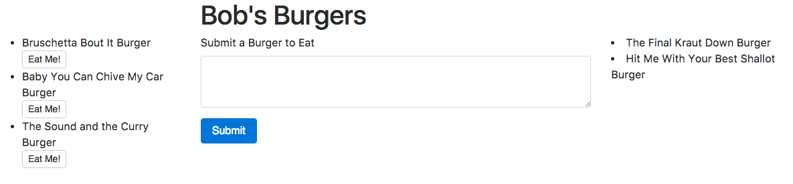

# Bob's Burgers Burger Eatery

A simple web application that allows users to add and eat "burgers." 

To add a burger, the user types in the name and hits the submit button. The burger is then added to the database with a default boolean of "false" for its devoured column and appears on the page with an "Eat Me!" button using Handbelars. 

When the user clicks an "Eat Me!" button, the boolean for devoured is changed from "false" to "true" in the databse and the burger is then moved to the "eaten" area in the HTML.

